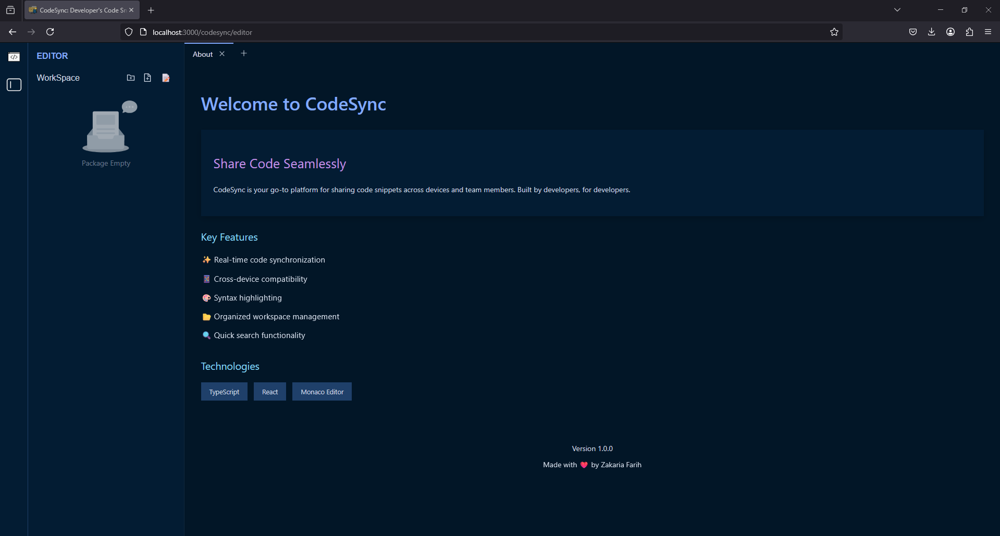
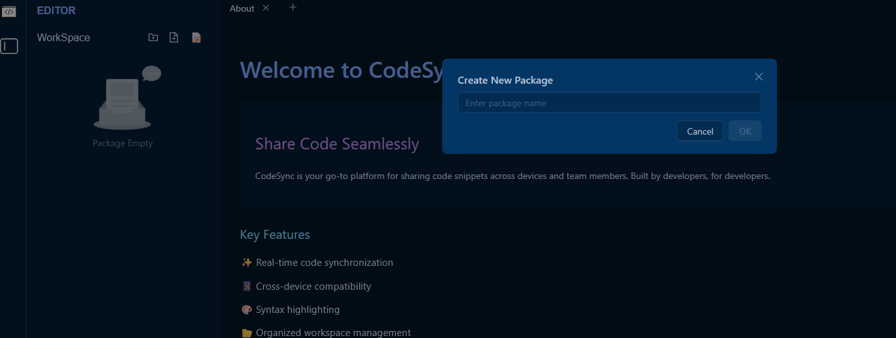
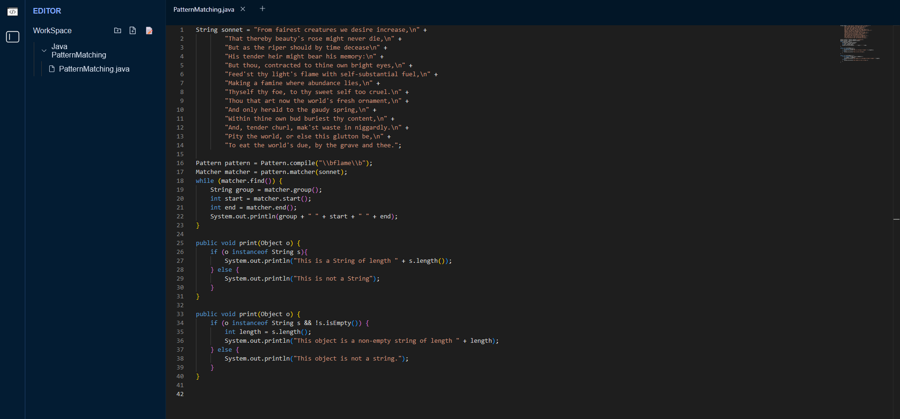
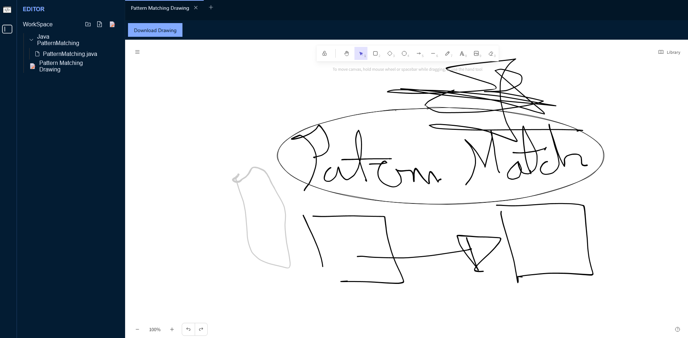

# CodeSync

A modern code editor and snippet manager with real-time collaboration features.

## Features

### Dark Theme Code Editor

Clean, modern interface with syntax highlighting and Night Owl-inspired color scheme.

### Package Management

Organize your code snippets into packages with an intuitive file explorer.

### Collaborative Drawing

Built-in drawing tools for system diagrams and architectural sketches.

### Mobile Responsive

Fully responsive design that works seamlessly on mobile devices.

## Tech Stack

- React
- TypeScript
- Ant Design
- Monaco Editor
- Excalidraw

## Development

To get started:

```bash
npm install
npm start
```

The app will be available at `http://localhost:3000`